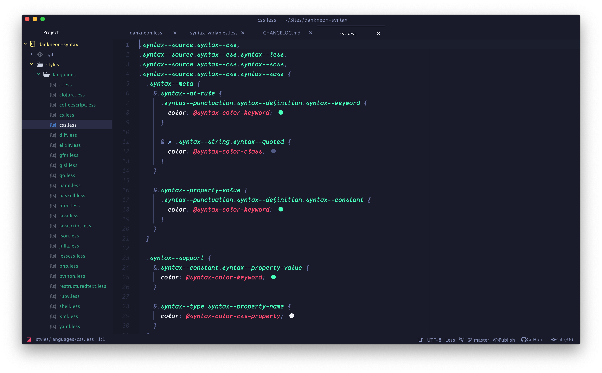

# DankNeon for Atom

A danker, more neon theme for [Atom](http://atom.io).

# Installation

Fire up your Terminal and type

`apm install dankneon-syntax`

Or, inside Atom's Settings page go to Install and search for *dankneon-syntax* with the filter set to *Themes*.

### UI-Theme
If you want your UI to fit the syntax theme, then take a look at our [DankNeon Atom UI theme](https://atom.io/themes/dankneon-ui).

# Team

This theme is maintained by the following people

|  |  |  |
|:---:|:---:|:---:|
| [Stephanie H.](https://github.com/stephfh) | [Jacobi Petrucciani](https://github.com/jpetrucciani)                                                               | [Conlin Durbin](https://github.com/wuz)                                                               |

# License

[MIT License](./LICENSE)

# Feedback
Are you enjoying the DankNeon theme? Let us know, also don't hesitate letting us know if you run into bugs or if you have ideas to make it better. 😉
